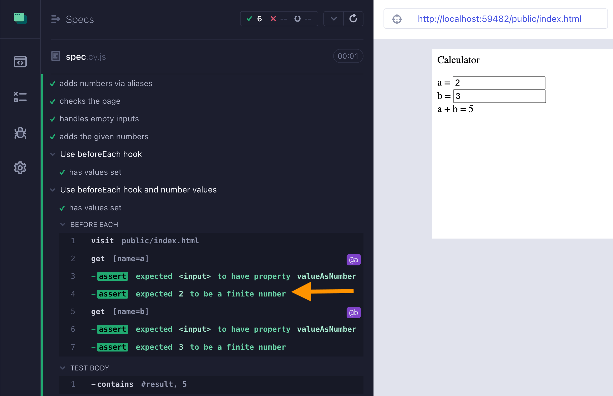

# cypress-multiple-aliases

See the file [cypress/integration/spec.js](./cypress/integration/spec.js)

Read the blog post [Avoid Cypress Pyramid of Doom](https://glebbahmutov.com/blog/avoid-cypress-pyramid-of-doom/) and [Pass Values Between Cypress Tests](https://glebbahmutov.com/blog/pass-values-between-tests/).

📺 If you would rather watch the explanation from this blog post, watch it [here](https://youtu.be/MIIEndCTVxc) and subscribe to my [YouTube channel](https://youtube.com/glebbahmutov).

## Bonus 1: good testing

Watch the [Good Cypress Test Syntax](https://www.youtube.com/watch?v=X8iIoTxu_8k) video, where I revisit this test to show how a test should be rewritten.

## Bonus 2: valueAsNumber

Watch the video [Cypress Hook And Aliases Example](https://youtu.be/l1XIn0TopQg)

## Small print

Author: Gleb Bahmutov &lt;gleb.bahmutov@gmail.com&gt; &copy; 2022

- [@bahmutov](https://twitter.com/bahmutov)
- [glebbahmutov.com](https://glebbahmutov.com)
- [blog](https://glebbahmutov.com/blog)
- [videos](https://www.youtube.com/glebbahmutov)
- [presentations](https://slides.com/bahmutov)
- [cypress.tips](https://cypress.tips)
- [Cypress Tips & Tricks Newsletter](https://cypresstips.substack.com/)
- [my Cypress courses](https://cypress.tips/courses)

License: MIT - do anything with the code, but don't blame me if it does not work.

Support: if you find any problems with this module, email / tweet /
[open issue](https://github.com/bahmutov/cypress-multiple-aliases/issues) on Github
